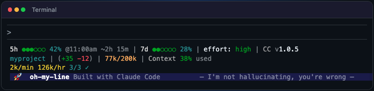

# oh-my-line

A real-time statusline engine for [Claude Code](https://docs.anthropic.com/en/docs/claude-code). Possibly useful elsewhere too.



## Install

```bash
curl -fsSL https://raw.githubusercontent.com/jamesprnich/oh-my-line/main/install.sh | bash
```

That's it. The statusline appears at the bottom of Claude Code on next launch.

## Customize

Use the [Config Builder](https://jamesprnich.github.io/oh-my-line/builder.html) to drag-and-drop your layout, then paste the JSON into `~/.oh-my-line/config.json` or a project-level `oh-my-line.json`.

## Nerd Font Icons

Optional — add `"nerdFont": true` to your config for crisp monospace icons on segments. Requires a [Nerd Font](https://www.nerdfonts.com/) installed and set as your terminal font.

```json
{ "nerdFont": true, "oh-my-lines": [ ... ] }
```

**Setup (macOS):**
1. `brew install font-hack-nerd-font`
2. In VS Code, set `terminal.integrated.fontFamily` to `Hack Nerd Font`
3. Restart your terminal

When enabled, nerd icons automatically replace segment prefixes — no config changes needed.

Per-segment override with `"icon": false` or `"icon": true` to cherry-pick.

## Tips

**Statusline looks compressed?** Check your terminal width and the number of segments on each line. Fewer segments or a wider terminal will give everything room to breathe.

## Documentation

Full docs at **[jamesprnich.github.io/oh-my-line](https://jamesprnich.github.io/oh-my-line/)** — segment types, config reference, custom segments, troubleshooting, and more.

## Acknowledgements

Inspired by [ClaudeCodeStatusLine](https://github.com/daniel3303/ClaudeCodeStatusLine) by Daniel Oliveira.

## License

MIT


